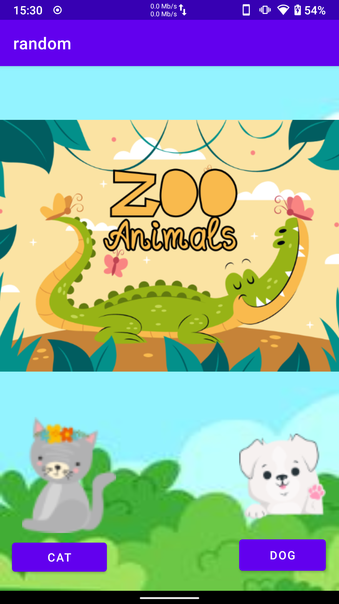
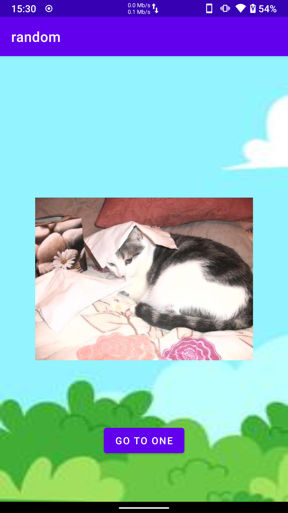

# random
   In this project, I made an android application that shows random animal pictures. There are two screens in the app. One of the screens is the homepage where we pull the APIs
   The other is the screen that randomly displays the picture. We get data from API. We transfer the random animal picture we received to the other page and present it to the user. 

## Requirements

## Installation

## Architecture

- Software Architectural Pattern: MVVM
- Libraries
  - Hilt
  - View Binding
  - Data Binding
  - Retrofit
  - Coroutine
  - Live Data
  - Navigation
  - Glide

## Screenshots
|Home|Cat|Dog|
|-| - |- |
|||
